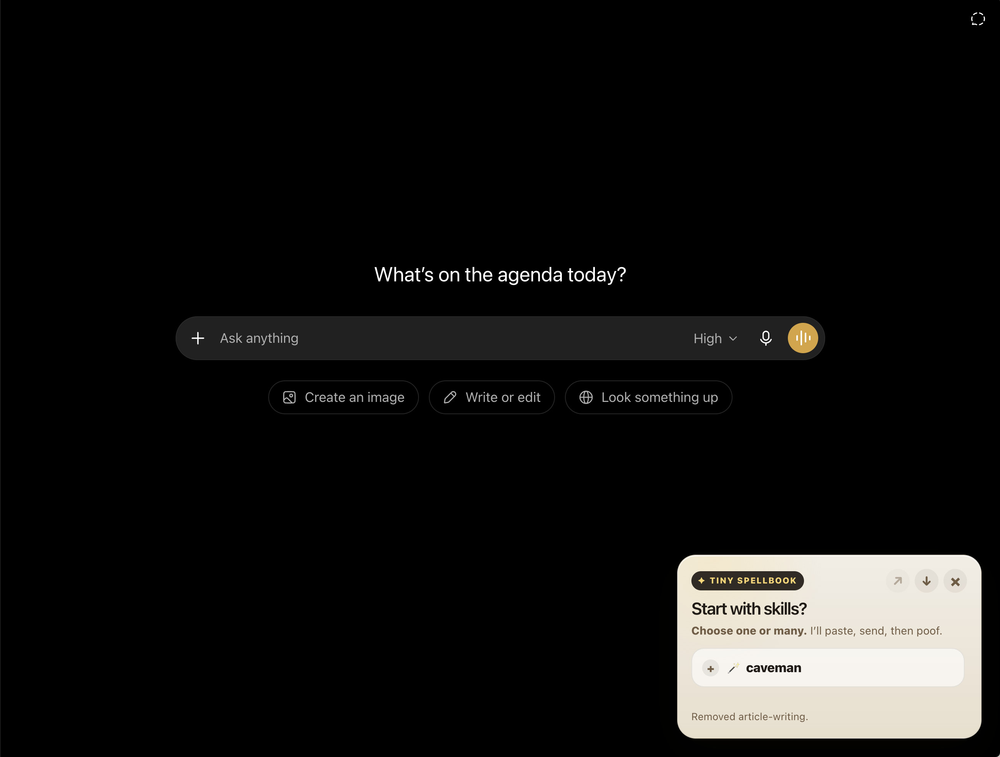

# Tiny Spellbook ✦

A tiny Arc/Chrome extension that lets you start ChatGPT chats with reusable markdown skills.

Pick one or more skills, launch them as the first ChatGPT message, then the widget gets out of the way. Think: a tiny spellbook for ChatGPT.

<p align="center">
  
</p>

## What it does

- Shows a subtle skill widget on the ChatGPT new-chat screen
- Reads local skills from the `skills/` folder
- Supports selecting multiple skills at once
- Pastes the selected skill markdown into the ChatGPT composer
- Sends the message automatically
- Disappears after launch
- Lets you search and load skills from [SkillsMP](https://skillsmp.com/)
- Stores loaded SkillsMP skills for later use
- Lets you remove loaded SkillsMP skills when you no longer need them

## Install in Arc or Chrome

1. Clone this repo:

   ```bash
   git clone https://github.com/tre3x/Tiny-Spellbook.git
   cd Tiny-Spellbook
   ```

2. Open your browser extensions page:

   - Arc: `arc://extensions`
   - Chrome: `chrome://extensions`

3. Enable **Developer mode**.
4. Click **Load unpacked**.
5. Select the `Tiny-Spellbook` folder.
6. Open `https://chatgpt.com/`.

## Usage

On a new ChatGPT chat, Tiny Spellbook appears as a small widget.

- Click a skill to select it
- Select multiple skills if needed
- Click the launch icon `↗`
- Tiny Spellbook pastes the combined skill prompt and sends it

Loaded SkillsMP skills have a small remove button, so you can clean them up later.

## Add local skills

Add markdown files to the `skills/` folder:

```txt
skills/
  caveman.md
  your-skill.md
```

Optional front matter is supported:

```md
---
name: your-skill
description: Short summary of what this skill does.
---

Write your skill instructions here.
```

Then rebuild the local skill index:

```bash
npm run build
```

Reload the extension from your browser extensions page.

## Load skills from SkillsMP

Click the load icon `↓` in the widget to search [SkillsMP](https://skillsmp.com/).

When you load a skill, Tiny Spellbook downloads its markdown from the skill's GitHub source and stores it in `chrome.storage.local`.

> Browser extensions cannot silently write downloaded files into this repo's local `skills/` folder. That is why SkillsMP-loaded skills are stored in browser extension storage instead.

## Project structure

```txt
Tiny-Spellbook/
  manifest.json              # Browser extension manifest
  content.js                 # ChatGPT widget + composer automation
  background.js              # SkillsMP search/load/storage logic
  style.css                  # Widget styles
  skills/                    # Local markdown skills
  scripts/generate-skill-index.js
  skill-index.json           # Generated local skill index
```

## Development

`npm run build` is only needed when you add, remove, or rename files in `skills/`. It regenerates `skill-index.json`, which the extension uses to know which local skills exist.

Regenerate `skill-index.json` after changing files in `skills/`:

```bash
npm run build
```

Useful checks:

```bash
node --check content.js
node --check background.js
python3 -m json.tool manifest.json >/dev/null
```

## Notes

Tiny Spellbook currently targets:

- `https://chatgpt.com/*`
- `https://chat.openai.com/*`

ChatGPT's UI can change over time, so composer/send-button selectors may need updates in the future.

## License

MIT — feel free to use, modify, and share.
